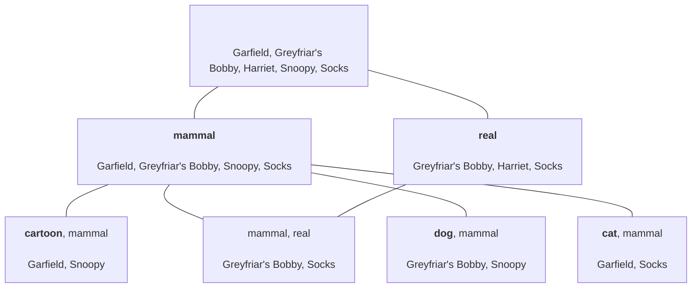
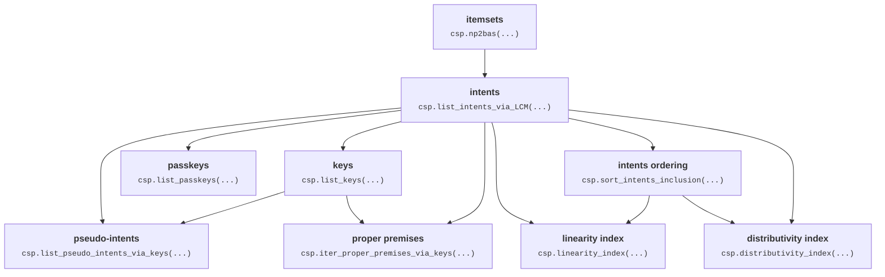

[](https://pypi.org/project/caspailleur)
[](https://github.com/smartFCA/caspailleur/actions/workflows/python-package.yml)
[](https://github.com/smartFCA/caspailleur/blob/main/LICENSE)
[](https://www.loria.fr/)
[](https://www.smartfca.org)

Caspailleur is a python package for mining concepts and implications in binary data with FCA framework.
Part of [SmartFCA](https://www.smartfca.org) ANR project.

## Get started

The stable version of the package can be installed from PyPI with:

```console
pip install caspailleur
```

and the latest version of the package can be installed from GitHub repository:

```console
pip install caspailleur@git+https://github.com/smartFCA/caspailleur
```

## Analysis example

### Glossary

The field of Formal Concept Analysis has many mathematical terms and some conflicting notation traditions.
Here is the glossary used throughout the `caspailleur` package: [Glossary.md](https://github.com/smartFCA/caspailleur/blob/main/Glossary.md).

### Data description

Let us study the "Famous Animals" dataset from [FCA repository](https://fcarepository.org):

```python
import caspailleur as csp
df, meta = csp.io.from_fca_repo('famous_animals_en')

print(meta)
print(df.replace({True: 'X', False: ''}))
```
> {
> **'title'**: 'Famous Animals',\
> **'source'**: 'Priss, U. (2006), Formal concept analysis in information science. Ann. Rev. Info. Sci. Tech., 40: 521-543. p.525',\
> **'size'**: {'objects': 5, 'attributes': 6},\
> **'language'**: 'English', \
> **'description'**: 'famous animals and their characteristics' }

|                   | cartoon   | real   | tortoise   | dog   | cat   | mammal   |
|:------------------|:----------|:-------|:-----------|:------|:------|:---------|
| Garfield          | X         |        |            |       | X     | X        |
| Snoopy            | X         |        |            | X     |       | X        |
| Socks             |           | X      |            |       | X     | X        |
| Greyfriar's Bobby |           | X      |            | X     |       | X        |
| Harriet           |           | X      | X          |       |       |          |

The received `df` object is a pandas dataframe.
Other supported context data types can be found in [Supported data formats](#supported-data-formats) section.
Caspailleur works fast enough with datasets of hundreds of objects and dozens of attributes.
Here, we choose a tiny dataset for illustrative purposes.

> [!TIP]
> Caspailleur package can only work with binary data (and is optimised for this). 
> You can consult [Paspailleur](https://github.com/EgorDudyrev/paspailleur) package 
> that extends Caspailleur functionality for complex non-binary data.


### Mining concepts
Now we can find all concepts in the data:

```python
concepts_df = csp.mine_concepts(df)

print(concepts_df[['extent', 'intent']].map(', '.join))
```

_<details><summary>Concepts table (13 rows)</summary>_
<p>

|   concept_id | extent                                              | intent                                    |
|-------------:|:----------------------------------------------------|:------------------------------------------|
|            0 | Greyfriar's Bobby, Snoopy, Harriet, Socks, Garfield |                                           |
|            1 | Greyfriar's Bobby, Socks, Garfield, Snoopy          | mammal                                    |
|            2 | Greyfriar's Bobby, Socks, Harriet                   | real                                      |
|            3 | Garfield, Snoopy                                    | cartoon, mammal                           |
|            4 | Greyfriar's Bobby, Socks                            | mammal, real                              |
|            5 | Greyfriar's Bobby, Snoopy                           | dog, mammal                               |
|            6 | Socks, Garfield                                     | cat, mammal                               |
|            7 | Harriet                                             | tortoise, real                            |
|            8 | Snoopy                                              | cartoon, dog, mammal                      |
|            9 | Garfield                                            | cartoon, cat, mammal                      |
|           10 | Greyfriar's Bobby                                   | mammal, dog, real                         |
|           11 | Socks                                               | cat, mammal, real                         |
|           12 |                                                     | mammal, cartoon, cat, dog, real, tortoise |

</p></details>

The number of concepts is exponential to the number of objects and attributes in the data.
To find only the most interesting concepts, specify `min_support`, `min_delta_stability` and/or `n_stable_concepts` parameters:
```python
concepts_df = csp.mine_concepts(
  df, min_support=3, min_delta_stability=1,
  to_compute=['intent', 'keys', 'support', 'delta_stability', 'sub_concepts']
)

print(concepts_df)
```

|   concept_id | intent     | keys         |   support |   delta_stability | sub_concepts   |
|-------------:|:-----------|:-------------|----------:|------------------:|:---------------|
|            0 | set()      | [set()]      |         5 |                 1 | {1, 2}         |
|            1 | {'mammal'} | [{'mammal'}] |         4 |                 2 | set()          |
|            2 | {'real'}   | [{'real'}]   |         3 |                 1 | set()          |


### Mining implications

For many datasets, the number of concepts is too large to be read by hand.
Luckily, relationships between attributes can be described via implication bases whose number is usually much smaller.

```python
implications_df = csp.mine_implications(df)

print(implications_df[['premise', 'conclusion', 'support']])
```
_<details><summary>Implications table (4 rows)</summary>_
<p>

|   implication_id | premise      | conclusion   |   support |
|-----------------:|:-------------|:-------------|----------:|
|                0 | {'cartoon'}  | {'mammal'}   |         2 |
|                1 | {'tortoise'} | {'real'}     |         1 |
|                2 | {'dog'}      | {'mammal'}   |         2 |
|                3 | {'cat'}      | {'mammal'}   |         2 |

</p></details>
 
We can read the implications in the table and find out dependencies in the data. For example:
- every famous cartoon animal is a mammal\
(from impl. 0: _cartoon -> mammal_);
- one can find famous tortoises only in real life\
(from impl. 1: _tortoise -> real_);

Set `min_support=0` to see implications on contradicting subsets of attributes, e.g.:
- nobody is a dog and a cat at the same time  \
  (from: _dog, cat -> ..._ with support 0).
  
Note, however, that there can be _a lot of_ implications with 0 support. 
And so their computation might take a lot of time.

  
If finding full implication basis takes too much time, one can mine only a part of columns and implications:
```python
implications_df = csp.mine_implications(
  df, basis_name='Canonical', unit_base=True,
  to_compute=['premise', 'conclusion', 'extent'],
  min_support=2,
)

print(implications_df)
```
|   implication_id | premise     | conclusion   | extent                          |
|-----------------:|:------------|:-------------|:--------------------------------|
|                0 | {'cat'}     | mammal       | {'Socks', 'Garfield'}           |
|                1 | {'dog'}     | mammal       | {"Greyfriar's Bobby", 'Snoopy'} |
|                2 | {'cartoon'} | mammal       | {'Garfield', 'Snoopy'}          |


The supported bases are _Canonical_ basis (a.k.a. _Pseudo-Intent_ or _Duquenne-Guigues_ basis)
and _Canonical Direct_ basis (a.k.a. _Proper Premise_ or _Karell_ basis).
Every basis can also be transformed in a unit-base where every conclusion consists of only one attribute.

### Mining descriptions

Finally, Caspailleur can output all descriptions in the data and their characteristics.
But note that the `number of descriptions` = 2^`number of attributes`.

```python
descriptions_df = csp.mine_descriptions(df)

print('__n. attributes:__', df.shape[1])
print('__n. descriptions:__', len(descriptions_df))
print('__columns:__', ', '.join(descriptions_df.columns))
print(descriptions_df[['description', 'support', 'is_key']].head(3))
```
> __n. attributes:__ 6 \
> __n. descriptions:__ 64
 
> __columns:__ description, extent, intent, support, delta_stability, is_closed, is_key, is_passkey, is_proper_premise, is_pseudo_intent


|   description_id | description |   support | is_key   |
|-----------------:|:------------|----------:|:---------|
|                0 | set()       |         5 | True     |
|                1 | {cartoon}   |         2 | True     |
|                2 | {real}      |         3 | True     |


### Visualising concept lattice

Caspailleur package does not support concept lattice visualisation (this task deserves its own package).
For a basic concept lattice visualisation, one can produce a `mermaid` diagram code.
Mermaid diagrams can be visualised via https://mermaid.live/ service or can be embedded in GitHub flavored markdown.

```python
concepts_df = csp.mine_concepts(df, min_support=2)

# manually define what to show in the nodes of the diagram
new_intent_labels = ('<b>' + concepts_df['new_intent'].map(sorted).map(', '.join) + '</b>').replace('<b></b>', '')
old_intent_labels = (concepts_df['intent'] - concepts_df['new_intent']).map(sorted).map(', '.join)
intent_labels = (new_intent_labels + ';' + old_intent_labels).map(lambda l: ', '.join(l.strip(';').split(';')))
extent_labels = concepts_df['extent'].map(sorted).map(', '.join)

node_labels = intent_labels + '<br><br>' + extent_labels
node_labels = [l.replace(' ', '&nbsp') for l in node_labels] # replace space with non-breakable space for better Mermaid visualisation

diagram_code = csp.io.to_mermaid_diagram(node_labels, concepts_df['previous_concepts'])
print(diagram_code)
```


_If, above, you see the source of the diagram, visit the [GitHub version](https://github.com/smartFCA/caspailleur)
of this ReadMe for the diagram itself.
If, above, you see the diagram, go to the source code of the ReadMe for the diagram code._

 

## Supported data formats

A formal context can be defined using many data types.

Below is the list of context types and examples acceptable by high-level `caspailleur` functions:
_<details><summary>Supported data types</summary>_
<p>

### PandasContextType
A binary Pandas dataframe.
Can be obtained via `csp.io.to_pandas` function.

Example:
```python
print(csp.io.to_pandas(df))
```
|                   |   cartoon |   real |   tortoise |   dog |   cat |   mammal |
|:------------------|----------:|-------:|-----------:|------:|------:|---------:|
| Garfield          |         True |      False |          False |     False |     True |        True |
| Snoopy            |         True |      False |          False |     True |     False |        True |
| Socks             |         False |      True |          False |     False |     True |        True |
| Greyfriar's Bobby |         False |      True |          False |     True |     False |        True |
| Harriet           |         False |      True |          True |     False |     False |        False |

### ItemsetContextType
A list of sets of indices of True columns in the data.
Can be obtained via `csp.io.to_itemsets` function.

Example:
```python
print(*csp.io.to_itemsets(df), sep='\n')
```
> {0, 4, 5} <br>
> {0, 3, 5} <br>
> {1, 4, 5} <br>
> {1, 3, 5} <br>
> {1, 2}


### NamedItemsetContextType
A triplet: (_ItemsetContextType_, object names, attribute names).
Can be obtained via `csp.io.to_named_itemsets` function.

Example:
```python
print(*csp.io.to_named_itemsets(df), sep='\n')
```
> [{0, 4, 5}, {0, 3, 5}, {1, 4, 5}, {1, 3, 5}, {1, 2}] <br>
> ['Garfield', 'Snoopy', 'Socks', "Greyfriar's Bobby", 'Harriet'] <br>
> ['cartoon', 'real', 'tortoise', 'dog', 'cat', 'mammal']


### BitarrayContextType
A list of bitarrays where every bitarray represents "active" attributes in object's description
Can be obtained via `csp.io.to_bitarrays` function;

Example:
```python
print(*csp.io.to_bitarrays(df), sep='\n')
```
> bitarray('100011') <br>
> bitarray('100101') <br>
> bitarray('010011') <br>
> bitarray('010101') <br>
> bitarray('011000')

### NamedBitarrayContextType
A triplet: (_BitarrayContextType_, object names, attribute names).
Can be obtained via `csp.io.to_named_bitarrays` function;

Example:
```python
print(*csp.io.to_named_bitarrays(df), sep='\n')
```
> [bitarray('100011'), bitarray('100101'), bitarray('010011'), bitarray('010101'), bitarray('011000')] <br>
> ['Garfield', 'Snoopy', 'Socks', "Greyfriar's Bobby", 'Harriet'] <br>
> ['cartoon', 'real', 'tortoise', 'dog', 'cat', 'mammal']

### BoolContextType
A list of object's descriptions where every description is a list of bool values.
Can be obtained via `csp.io.to_bools` function;

Example:
```python
print(*csp.io.to_bools(df), sep='\n')
```
> [True, False, False, False, True, True] <br>
> [True, False, False, True, False, True] <br>
> [False, True, False, False, True, True] <br>
> [False, True, False, True, False, True] <br>
> [False, True, True, False, False, False]


### NamedBoolContextType
A triplet: (_BoolContextType_, object names, attribute names).
Can be obtained via `csp.io.to_named_bools` function;

Example:
```python
print(*csp.io.to_named_bools(df), sep='\n')
```
> [[True, False, False, False, True, True], [True, False, False, True, False, True], [False, True, False, False, True, True], [False, True, False, True, False, True], [False, True, True, False, False, False]]<br>
> ['Garfield', 'Snoopy', 'Socks', "Greyfriar's Bobby", 'Harriet']<br>
> ['cartoon', 'real', 'tortoise', 'dog', 'cat', 'mammal']

### DictContextType
A dictionary where every key is an object's name and every value if object's description represented with sets of names of attributes.
Can be obtained via `csp.io.to_dictionary` function.

Example:
```python
print(csp.io.to_dictionary(df))
```
> {'Garfield': {'cartoon', 'mammal', 'cat'},<br> 
> 'Snoopy': {'dog', 'cartoon', 'mammal'}, <br>
> 'Socks': {'real', 'mammal', 'cat'}, <br>
> "Greyfriar's Bobby": {'real', 'mammal', 'dog'},<br> 
> 'Harriet': {'real', 'tortoise'}<br>
> }
 
</p></details>

### Save and load Formal Context 

A formal context can also be saved to and loaded from a .cxt formatted file or a string:
```python
with open('context.cxt', 'w') as file:
    csp.io.write_cxt(df, file)

with open('context.cxt', 'r') as file:
    df_loaded = csp.io.read_cxt(file)

assert (df == df_loaded).all(None)
```

## Approach for faster computation

Caspailleur does three things to fasten up the computations:
1. It exploits the connections between characterisic attribute sets.\
E.g. a function to compute proper premises takes intents and keys as inputs, and not the original binary data.
2. The set of intents is computed by LCM algorithm\
well-implemented in scikit-mine package: https://pypi.org/project/scikit-mine/;
3. All intrinsic computations are performed with bitwise operations\
provided by bitarray package: https://pypi.org/project/bitarray/


The diagram below presents dependencies between the characteristic attribute sets. For example, the arrow "intents -> keys" means that the set of intents is required to compute the set of keys.


_In case the diagram is not compiling, visit the GitHub version of README: https://github.com/smartFCA/caspailleur_


> [!NOTE]
> Although `caspailleur` package implements many optimisations to fasten up the computations, we do not state that it is the fastest FCA package ever existed.
> For example, our algorithm for computing pseudo-intent basis is far from the state-of-art.
> Knowing that, we find `caspailleur` fast enough for comfortable everyday use.

## How to cite

There are no papers written about caspailleur (yet). So you can cite the package itself.

```bibtex
@misc{caspailleur,
  title={caspailleur},
  author={Dudyrev, Egor},
  year={2023},
  howpublished={\url{https://www.smartfca.org/software}},
}
```

## Funding

The package development is supported by ANR project SmartFCA [(ANR-21-CE23-0023)](https://anr.fr/Projet-ANR-21-CE23-0023).

SmartFCA ([https://www.smartfca.org/](https://www.smartfca.org/)) is a big platform that will contain many extensions
of Formal Concept Analysis including pattern structures, Relational Concept Analysis, Graph-FCA and others. 
While caspailleur is a small python package that covers only the basic notions of FCA. 
