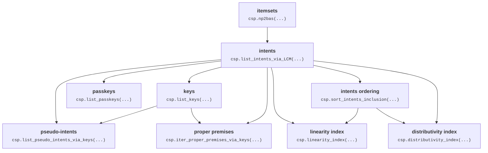

# caspailleur

Lightweight python package to explore binary data in FCA terms.

## Get started

To install the package, please download it from this GitHub page.

```console
git clone https://github.com/EgorDudyrev/caspailleur.git
pip install caspailleur/
```


## Outline

Caspaiileur is a python package designed to mine many characteristic attribute sets from data at once with high speed.

These sets are:
* intents (a.k.a. closed itemsets, closed descriptions),
* keys (a.k.a. minimal generators),
* passkeys (a.k.a. mimimum generators),
* pseudo-intents, and
* proper premises.

Also, caspailleur contains functions to compute linearity and distributivity indices to measure the complexity of the data.

Mathematical definitions of intents, keys and others are presented in the paper: _Buzmakov, A., Dudyrev, E., Kuznetsov, S. O., Makhalova, T., & Napoli, A. Data complexity: An FCA-based approach https://hal.science/hal-03970678v1._
Definitions in a form of Python code are given in "definitions" module: [caspailleur/definitions.py](https://github.com/EgorDudyrev/caspailleur/blob/cbcb75aedbbe80db56b4dbb086b2419c9bc2194c/caspailleur/definitions.py)

## Approach for faster computation

Caspailleur does three things to fasten up the computations:
1. It exploits the connections between characterisic attribute sets.\
E.g. a function to compute proper premises takes intents and keys as inputs, and not the original binary data.
2. The set of intents is computed by LCM algorithm\
well-implemented in scikit-mine package: https://pypi.org/project/scikit-mine/;
3. All intrinsic computations are performed with bitwise operations\
provided by bitarray package: https://pypi.org/project/bitarray/


The diagram below presents dependencies between the characteristic attribute sets. For example, the arrow "intents -> keys" means that the set of intents is required to compute the set of keys.



## Funding

The package development is supported by ANR project SmartFCA [(ANR-21-CE23-0023)](https://anr.fr/Projet-ANR-21-CE23-0023).

SmartFCA ([https://www.smartfca.org/](https://www.smartfca.org/)) is a big platform that will contain many extensions
of Formal Concept Analysis including pattern structures, Relational Concept Analysis, Graph-FCA and others. 
While caspailleur is a small python package that covers only the basic notions of FCA. 
