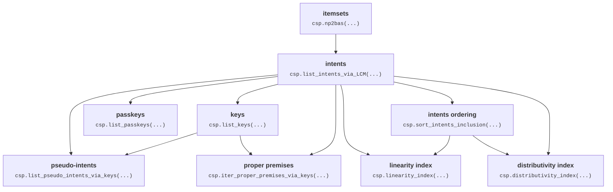

[](https://pypi.org/project/caspailleur)
[](https://github.com/EgorDudyrev/caspailleur/actions/workflows/python-package.yml)
[](https://github.com/EgorDudyrev/caspailleur/blob/main/LICENSE)
[](https://www.loria.fr/)
[](https://www.smartfca.org)


# caspailleur
A python package for mining concepts and implications in binary data with FCA framework.
Part of [SmartFCA](https://www.smartfca.org) ANR project.


## Get started

The stable version of the package can be installed from PyPI with:

```console
pip install caspailleur
```

and the latest version of the package can be installed from GitHub repository:

```console
pip install caspailleur@git+https://github.com/EgorDudyrev/caspailleur
```

## Studying data example

### Data description

Let us study the following "Fruit" dataset:

|       title | firm   | smooth   | fruit   | color   | form   |
|------------:|--------|----------|---------|---------|--------|
|       apple |        | ✓        | ✓       | yellow  | round  |
|  grapefruit |        |          | ✓       | yellow  | round  |
|        kiwi |        |          | ✓       | green   | oval   |
|        plum |        | ✓        | ✓       | blue    | oval   |
|       mango |        | ✓        | ✓       | green   | oval   |


Caspailleur package can only work with binary data (and is optimised for this).
You can consult [Paspailleur](https://github.com/EgorDudyrev/paspailleur) package 
that extends Caspailleur functionality for complex non-binary data.

Let us download binarised version of the same data:
```python
import pandas as pd
df = pd.read_csv('https://raw.githubusercontent.com/EgorDudyrev/FCApy/main/data/mango_bin.csv', index_col=0)
df = df[df['fruit']]

print("__Objects:__", ', '.join(df.index))
print("__Attributes:__", ', '.join(df.columns))
print(df)
```
> __Objects:__ apple, grapefruit, kiwi, plum, mango

> __Attributes:__ firm, smooth, fruit, color_is_yellow, color_is_green, color_is_blue, color_is_white, 
> form_is_round, form_is_oval, form_is_cubic


_<details><summary>Binarised fruit dataset</summary>_
<p>

> |       title | firm  | smooth | fruit | ... | form_is_round  | form_is_oval   | form_is_cubic |
> |------------:|-------|--------|-------|-----|----------------|----------------|---------------|
> |       apple | False | True   | True  | ... | True           | False          | False         |
> |  grapefruit | False | False  | True  | ... | True           | False          | False         |
> |        kiwi | False | False  | True  | ... | False          | True           | False         |
> |        plum | False | True   | True  | ... | False          | True           | False         |
> |       mango | False | True   | True  | ... | False          | True           | False         |
> [5 rows x 10 columns]
</p></details>

In FCA terminology, indices of rows are called **objects** and indices of (binary) columns are called **attributes**. 


### Mining concepts
Now we can find all concepts in the data:

```python
import pandas as pd
df = pd.read_csv('https://raw.githubusercontent.com/EgorDudyrev/FCApy/main/data/mango_bin.csv', index_col=0)
df = df[df['fruit']]

import caspailleur as csp
concepts_df = csp.mine_concepts(df)

print(concepts_df[['extent', 'intent']].map(', '.join))
```

_<details><summary>Concepts table (10 rows)</summary>_
<p>

> | concept_id | extent                               | intent                                                                                                                          |
> |-----------:|--------------------------------------|---------------------------------------------------------------------------------------------------------------------------------|
> | 0          | plum, mango, grapefruit, apple, kiwi | fruit                                                                                                                           |
> | 1          | plum, mango, apple                   | smooth, fruit                                                                                                                   |
> | 2          | plum, kiwi, mango                    | form_is_oval, fruit                                                                                                             |
> | 3          | plum, mango                          | form_is_oval, smooth, fruit                                                                                                     |
> | 4          | grapefruit, apple                    | color_is_yellow, form_is_round, fruit                                                                                           |
> | 5          | kiwi, mango                          | form_is_oval, color_is_green, fruit                                                                                             |
> | 6          | apple                                | smooth, color_is_yellow, form_is_round, fruit                                                                                   |
> | 7          | mango                                | form_is_oval, color_is_green, smooth, fruit                                                                                     |
> | 8          | plum                                 | form_is_oval, color_is_blue, smooth, fruit                                                                                      |
> | 9          |                                      | firm, color_is_yellow, form_is_round, form_is_oval, color_is_green, color_is_blue, smooth, form_is_cubic, color_is_white, fruit |

</p></details>

Every concept (or _formal_ concept) corresponds to a subset of rows (called **extent**)
and a subset of columns (called **intent**) describing the extent. 
The set of extents shows _all possible ways_ to select a subset of rows.
The set of intents shows _the most precise descriptions_ of the corresponding extents.

Concepts DataFrame also contains additional information about concepts.
- Interestingness measures
  - **support**: how many objects are covered by the concept\
  (i.e. how general is the concept);
  - **delta_stability**: how many objects one will lose when making the concept a bit more precise\
  (so stable concepts are precise, but not too precise);
- Minimal descriptions
  - **keys**: minimal descriptions selecting the concept;
  - **passkeys**: the smallest (in size) descriptions selecting the concept;
- Premises of implication bases
  - **proper_premises**: descriptions of the concept used in Proper Premise implication basis\
  (also, Canonical Direct implication basis);
  - **pseudo_intents**: descriptions of the concepts used in Pseudo Intents implication basis\
  (also, Canonical implication basis);
- Order of concepts (by generality)
  - **preceding**: indices of _next_ less general concepts;
  - **succeeding**: indices of _next_ more general concepts;
  - **lesser**: indices of _all_ less general concepts;
  - **greater**: indices of _all_ more general concepts.

For the sake of running time, one can set up thresholds on concepts measures and names of specific columns to mine:
```python
import pandas as pd
df = pd.read_csv('https://raw.githubusercontent.com/EgorDudyrev/FCApy/main/data/mango_bin.csv', index_col=0)
df = df[df['fruit']]

import caspailleur as csp
concepts_df = csp.mine_concepts(
  df, min_support=3, min_delta_stability=1,
  to_compute=['intent', 'keys', 'support', 'delta_stability', 'lesser']
)
print(concepts_df)
```

| concept_id | intent                | keys             | support | delta_stability | lesser  |
|-----------:|-----------------------|------------------|---------|-----------------|---------|
|          0 | {fruit}               | [{}]             | 5       | 2               | {1 ,2}  |
|          1 | {fruit, smooth}       | [{smooth}]       | 3       | 1               | {}      |
|          2 | {fruit, form_is_oval} | [{form_is_oval}] | 3       | 1               | {}      |

Mathematical definitions of intents, keys and others are presented in the paper:
_Buzmakov, A., Dudyrev, E., Kuznetsov, S. O., Makhalova, T., & Napoli, A. Data complexity: An FCA-based approach https://hal.science/hal-03970678v1._
Definitions in a form of Python code are given in "definitions" module: [caspailleur/definitions.py](https://github.com/EgorDudyrev/caspailleur/blob/cbcb75aedbbe80db56b4dbb086b2419c9bc2194c/caspailleur/definitions.py)

### Mining implications

For many datasets, the number of concepts is too large to be read by hand.
Luckily, relationships between attributes can be described via implication bases whose number is usually much smaller
(although there may be many implications selecting no objects).

```python
import pandas as pd
df = pd.read_csv('https://raw.githubusercontent.com/EgorDudyrev/FCApy/main/data/mango_bin.csv', index_col=0)
df = df[df['fruit']]

import caspailleur as csp
implications_df = csp.mine_implications(df)

print(implications_df[['premise', 'conclusion']].map(', '.join))
```
_<details><summary>Implications table (15 rows)</summary>_
<p>

| implication_id | premise                           | conclusion                                        |
|---------------:|-----------------------------------|---------------------------------------------------|
|              0 |                                   | fruit                                             |
|              1 | form_is_round                     | color_is_yellow                                   |
|              2 | color_is_yellow                   | form_is_round                                     |
|              3 | color_is_green                    | form_is_oval                                      |
|              4 | color_is_blue                     | form_is_oval, smooth                              |
|              5 | form_is_cubic                     | firm, color_is_white, color_is_blue, color_is_... |
|              6 | color_is_white                    | firm, color_is_blue, color_is_yellow, form_is_... |
|              7 | firm                              | color_is_white, color_is_blue, color_is_yellow... |
|              8 | form_is_oval, form_is_round       | firm, color_is_white, color_is_blue, color_is_... |
|              9 | color_is_blue, form_is_round      | form_is_cubic, color_is_white, firm, color_is_... |
|             10 | form_is_round, color_is_green     | firm, color_is_white, color_is_blue, form_is_c... |
|             11 | color_is_blue, color_is_green     | firm, color_is_white, color_is_yellow, form_is... |
|             12 | form_is_oval, color_is_yellow     | firm, color_is_white, color_is_blue, color_is_... |
|             13 | color_is_yellow, color_is_blue    | form_is_cubic, color_is_white, firm, color_is_... |
|             14 | color_is_yellow, color_is_green   | firm, color_is_white, color_is_blue, form_is_c... |
</p></details>

We can read the implications in the table and find out dependencies in the data. For example:
- every object is a fruit\
(from impl. 0: _Ø -> fruit_);
- every round fruit is yellow and vice versa \
(from impl. 1: _form_is_round -> color_is_yellow_, and impl. 2: _color_is_yellow -> form is round_);
- firm fruits do not exist \
  (from impl. 7: _firm -> color_is_white, color_is_blue,..._ ).

Implications DataFrame also contains additional information about implications.
- **conclusion_full**: all attributes implied by the premise\
  (redundant w.r.t. the other implications)
- **extent**: the set of objects described by the premise
- **support**: how many objects are covered by the premise 


For the sake of running time, one can set up thresholds on implication measures and names of specific columns to mine:
```python
import pandas as pd
df = pd.read_csv('https://raw.githubusercontent.com/EgorDudyrev/FCApy/main/data/mango_bin.csv', index_col=0)
df = df[df['fruit']]

import caspailleur as csp
implications_df = csp.mine_implications(
  df, basis_name='Canonical', unit_base=True,
  to_compute=['premise', 'conclusion', 'support'],
  min_support=2, min_delta_stability=1
)

print(implications_df)
```
| implication_id | premise                  | conclusion      | support | 
|----------------|--------------------------|-----------------|---------|
| 0              | {}                       | fruit           | 5       |
| 1              | {fruit, color_is_green}  | form_is_oval    | 2       |
| 2              | {fruit, form_is_round}   | color_is_yellow | 2       |
| 3              | {fruit, color_is_yellow} | form_is_round   | 2       |

_Unit_base_ parameter makes the function return single attributes as conclusion (and not subset of attributes).
_Canonical_ basis is the basis containing _the smallest number_ of implications.
Although the premises of Canonical basis are longer than the premises of Canonical Direct basis.
You can get more information about the two bases in the docstring of `mine_implications` function.

### Mining descriptions

Finally, Caspailleur can output all descriptions in the data and their characteristics.
But note that the `number of descriptions` = 2^`number of attributes`.

```python
import pandas as pd
df = pd.read_csv('https://raw.githubusercontent.com/EgorDudyrev/FCApy/main/data/mango_bin.csv', index_col=0)
df = df[df['fruit']]

import caspailleur as csp
descriptions_df = csp.mine_descriptions(df)

print('__n. attributes:__', df.shape[1])
print('__n. descriptions:__', len(descriptions_df))
print('__columns:__', ', '.join(descriptions_df.columns))
print(descriptions_df[['description', 'support', 'is_key']].head(3))
```
> __n. attributes:__ 10 \
> __n. descriptions:__ 1024
 
> __columns:__ description, extent, intent, support, delta_stability, is_closed, is_key, is_passkey, is_proper_premise, is_pseudo_intent


| description_id | description | support | is_key |
|----------------|-------------|---------|--------|
| 0              | {}          | 5       | True   |
| 1              | {firm}      | 0       | True   |
| 2              | {smooth}    | 3       | True   |


## Approach for faster computation

Caspailleur does three things to fasten up the computations:
1. It exploits the connections between characterisic attribute sets.\
E.g. a function to compute proper premises takes intents and keys as inputs, and not the original binary data.
2. The set of intents is computed by LCM algorithm\
well-implemented in scikit-mine package: https://pypi.org/project/scikit-mine/;
3. All intrinsic computations are performed with bitwise operations\
provided by bitarray package: https://pypi.org/project/bitarray/


The diagram below presents dependencies between the characteristic attribute sets. For example, the arrow "intents -> keys" means that the set of intents is required to compute the set of keys.


_In case the diagram is not compiling, visit the GitHub version of README: https://github.com/EgorDudyrev/caspailleur_

## How to cite

There are no papers written about caspailleur (yet). So you can cite the package itself.

```bibtex
@misc{caspailleur,
  title={caspailleur},
  author={Dudyrev, Egor},
  year={2023},
  howpublished={\url{https://www.smartfca.org/software}},
}
```

## Funding

The package development is supported by ANR project SmartFCA [(ANR-21-CE23-0023)](https://anr.fr/Projet-ANR-21-CE23-0023).

SmartFCA ([https://www.smartfca.org/](https://www.smartfca.org/)) is a big platform that will contain many extensions
of Formal Concept Analysis including pattern structures, Relational Concept Analysis, Graph-FCA and others. 
While caspailleur is a small python package that covers only the basic notions of FCA. 
