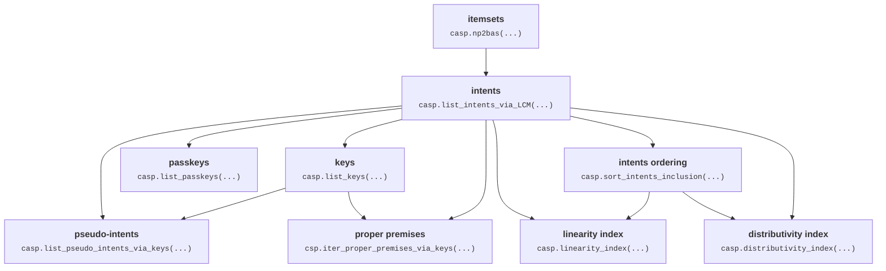

# caspailleur

Lightweight python package to explore binary data in FCA terms.

## Structure

## Funding

The package development is supported by ANR project SmartFCA [(ANR-21-CE23-0023)](https://anr.fr/Projet-ANR-21-CE23-0023).

SmartFCA ([https://www.smartfca.org/](https://www.smartfca.org/)) is a big platform that will contain many extensions
of Formal Concept Analysis including pattern structures, Relational Concept Analysis, Graph-FCA and others. 
While caspailleur is a small python package that covers only the basic notions of FCA. 
