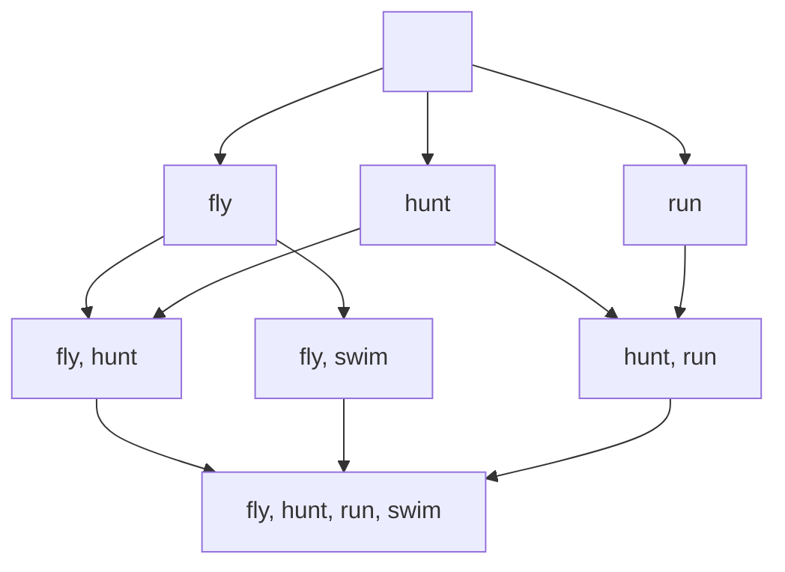
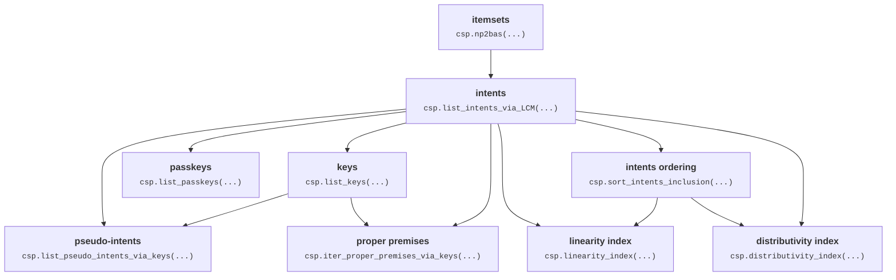

# caspailleur

Lightweight python package to explore binary data in FCA terms.

## Get started

To install the package, please download it from this GitHub page.

```console
git clone https://github.com/EgorDudyrev/caspailleur.git
pip install caspailleur/
```

## Run example

```python
# Load binary dataframe
import pandas as pd
df = pd.read_csv('https://raw.githubusercontent.com/EgorDudyrev/FCApy/main/data/animal_movement.csv', index_col=0)

# Explore the dataset
import caspailleur as csp
data_dict = csp.explore_data(df.values)
```

<details><summary>Elaborate on results</summary>
<p>

### Visualize the output
By default, caspailleur outputs the data stored in FrozenSets. So we need a bit 
```python
# Prettifying the output
import re
to_print = '\n'.join([f"{k}: {v}" for k, v in data_dict.items()])
to_print = to_print.replace('frozenset()', 'set()')
for _ in re.findall(r"frozenset\(.+?\)", to_print):
    to_print = re.sub(r"frozenset\((.+?)\)", r"\g<1>", to_print)
print(to_print)
```
> intents: [set(), {0}, {1}, {2}, {0, 1}, {0, 3}, {1, 2}, {0, 1, 2, 3}]\
> keys: {set(): 0, {0}: 1, {1}: 2, {2}: 3, {3}: 5, {0, 1}: 4, {0, 2}: 7, {1, 2}: 6, {1, 3}: 7, {2, 3}: 7}\
> passkeys: {set(): 0, {0}: 1, {1}: 2, {2}: 3, {3}: 5, {0, 1}: 4, {0, 2}: 7, {1, 2}: 6, {1, 3}: 7, {2, 3}: 7}\
> pseudo_intents: {{3}: 5, {0, 2}: 7, {0, 1, 3}: 7}\
> proper_premises: {{3}: 5, {0, 2}: 7, {1, 3}: 7, {2, 3}: 7}\
> intents_ordering: [set(), {0}, {0}, {0}, {1, 2}, {1}, {2, 3}, {4, 5, 6}]\
> linearity: 0.6428571428571429\
> distributivity: 0.75

### Dataset

The example dataset contains 16 rows (a.k.a. objects) and 4 columns (a.k.a. attributes).
The rows represent animals, and the columns show the actions the animals can perform.
For example, "dove" can "fly", but cannot "hunt".

```python
print(df.to_markdown().replace('1','X').replace('0',' '))
```
|       |   fly |   hunt |   run |   swim |
|:------|------:|-------:|------:|-------:|
| dove  |     X |        |       |        |
| hen   |       |        |       |        |
| duck  |     X |        |       |      X |
| goose |     X |        |       |      X |
| owl   |     X |      X |       |        |
| hawk  |     X |      X |       |        |
| eagle |     X |      X |       |        |
| fox   |       |      X |     X |        |
| dog   |       |        |     X |        |
| wolf  |       |      X |     X |        |
| cat   |       |      X |     X |        |
| tiger |       |      X |     X |        |
| lion  |       |      X |     X |        |
| horse |       |        |     X |        |
| zebra |       |        |     X |        |
| cow   |       |        |       |        |


### Verbose functions
First, let us define functions to match column indices with column names. 
```python
def verbose(indices, names, empty_symbol='∅'):
    return ', '.join([names[i] for i in sorted(indices)]) if indices else empty_symbol

def unpack_gens_dict(gens_dict, intents, show_difference: bool = True):
    dct = {k: intents[intent_i] for k, intent_i in gens_dict.items()}
    if show_difference:
        return {k: v-k for k, v in dct.items()}
    return dct
```

### Intents
Intents are maximal attribute sets that describe specific subsets of objects.
Intents are also known as "closed descriptions" and "closed itemsets".

```python
print('\n'.join([verbose(intent, df.columns) for intent in data_dict['intents']]))
```
> ∅\
> fly\
> hunt\
> run\
> fly, hunt\
> fly, swim\
> hunt, run\
> fly, hunt, run, swim

For example, attributes "fly, swim" are _all_ the attributes that describe "duck, goose".  

### Intents ordering

Intents can be ordered by set inclusion operation. Their order can be represented with line diagram:



The diagram was constructed with the following code: 

```python
def construct_mermaid_diagram(ordering, intents):
    node_names = 'ABCDEFGHIJKLMNOPQRSTUVWXYZ'

    defining_nodes = '\n'.join([
        f'{node_name}[{verbose(intent, df.columns, empty_symbol="fa:fa-empty-set")}];'
        for node_name, intent in zip(node_names, intents)]
    )

    defining_edges = '\n'.join([
        f'{node_names[parent_i]} --> {node_names[intent_i]};'
        for intent_i, parents in enumerate(ordering) for parent_i in parents]
    )
    
    diagram = f"graph TD; "+defining_nodes + defining_edges
    return diagram

print(construct_mermaid_diagram(data_dict['intents_ordering'], data_dict['intents']))
```

### Keys and passkeys

Keys are minimal subsets of attributes that describe specific subsets of objects.
And passkeys are keys of minimal cardinality.

So keys and passkeys are equivalent to intents (w.r.t. what objects they describe), but are smaller in size. 


```python
print('\n'.join([
    verbose(k, df.columns)+' ~ '+verbose(v, df.columns)
    for k, v in unpack_gens_dict(data_dict['keys'], data_dict['intents'], show_difference=False).items()
    if k != v
]))
```
> swim ~ fly, swim\
> fly, run ~ fly, hunt, run, swim\
> hunt, swim ~ fly, hunt, run, swim\
> run, swim ~ fly, hunt, run, swim

Here are examples of keys in the dataset that differ from their corresponding intents.
For example, both "swim" and "fly, swim" describe the same objects "duck, goose" (so they are equivalent).
But the former is a minimal subset (therefore a key), and the latter is a maximal subset (therefore an intent).  

In this example, the sets of keys and passkeys are the same. But they can differ on bigger datasets.

### Proper premises

The set of proper premises form a direct (or iteration-free) base of implications. 
Thus, al implications in the dataset can be obtained with a single application of Armstrong rules
to the proper premise implications. 

```python
print('\n'.join([
    verbose(k, df.columns)+' -> '+verbose(v, df.columns)
    for k, v in unpack_gens_dict(data_dict['proper_premises'], data_dict['intents'], show_difference=True).items()
]))
```
> swim -> fly\
> fly, run -> hunt, swim\
> hunt, swim -> fly, run\
> run, swim -> fly, hunt

Example shows that, according to the dataset, every animal who can swim can fly.
And every animal who can fly and run can also hunt and swim.

### Pseudo-intents

Pseudo-intents are subsets of attributes. The set of pseudo-intents forms an implication basis of minimum cardinality.

```python
print('\n'.join([
    verbose(k, df.columns)+' -> '+verbose(v, df.columns)
    for k, v in unpack_gens_dict(data_dict['pseudo_intents'], data_dict['intents'], show_difference=True).items()
]))
```
> swim -> fly\
> fly, run -> hunt, swim\
> fly, hunt, swim -> run

Note that there are 4 proper premises in the dataset, and only 3 pseudo-intents. 
So the set of pseudo-intents gives smaller amount of implication. 

### Complexity indices

Complexity indices are FCA-based tools to measure the complexity of the dataset. 

Linearity index shows the percentage of comparable pairs of intents in a lattice.
And distributivity index shows the percentage of pairs of intents, such that their union is also an intent.

```python
for k in ['linearity', 'distributivity']:
    print(k, data_dict[k])
```
> linearity 0.6428571428571429\
> distributivity 0.75

</p>
</details>


## Outline

Caspaiileur is a python package designed to mine many characteristic attribute sets from data at once with high speed.

These sets are:
* intents (a.k.a. closed itemsets, closed descriptions),
* keys (a.k.a. minimal generators),
* passkeys (a.k.a. mimimum generators),
* pseudo-intents, and
* proper premises.

Also, caspailleur contains functions to compute linearity and distributivity indices to measure the complexity of the data.

Mathematical definitions of intents, keys and others are presented in the paper:
_Buzmakov, A., Dudyrev, E., Kuznetsov, S. O., Makhalova, T., & Napoli, A. Data complexity: An FCA-based approach https://hal.science/hal-03970678v1._
Definitions in a form of Python code are given in "definitions" module: [caspailleur/definitions.py](https://github.com/EgorDudyrev/caspailleur/blob/cbcb75aedbbe80db56b4dbb086b2419c9bc2194c/caspailleur/definitions.py)

## Approach for faster computation

Caspailleur does three things to fasten up the computations:
1. It exploits the connections between characterisic attribute sets.\
E.g. a function to compute proper premises takes intents and keys as inputs, and not the original binary data.
2. The set of intents is computed by LCM algorithm\
well-implemented in scikit-mine package: https://pypi.org/project/scikit-mine/;
3. All intrinsic computations are performed with bitwise operations\
provided by bitarray package: https://pypi.org/project/bitarray/


The diagram below presents dependencies between the characteristic attribute sets. For example, the arrow "intents -> keys" means that the set of intents is required to compute the set of keys.


## Funding

The package development is supported by ANR project SmartFCA [(ANR-21-CE23-0023)](https://anr.fr/Projet-ANR-21-CE23-0023).

SmartFCA ([https://www.smartfca.org/](https://www.smartfca.org/)) is a big platform that will contain many extensions
of Formal Concept Analysis including pattern structures, Relational Concept Analysis, Graph-FCA and others. 
While caspailleur is a small python package that covers only the basic notions of FCA. 
